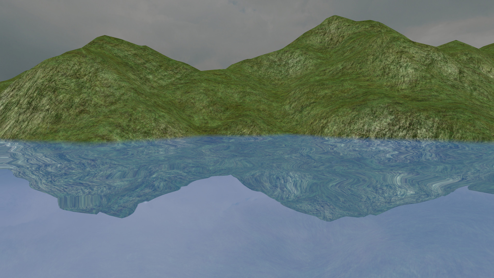
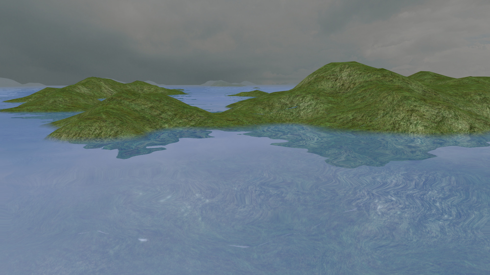
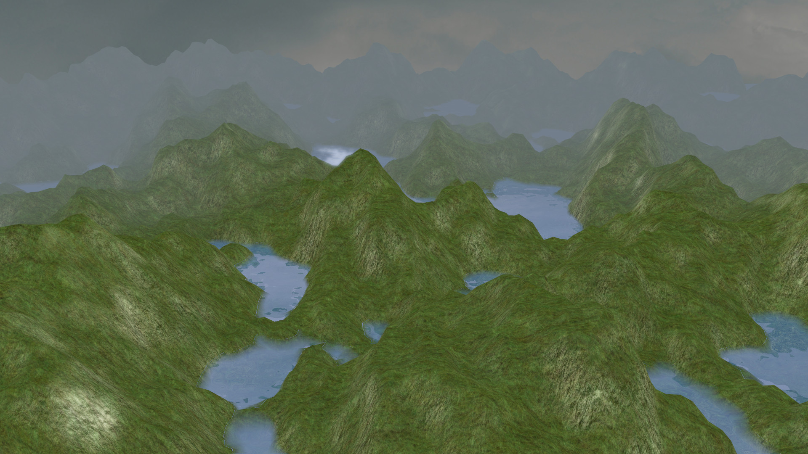
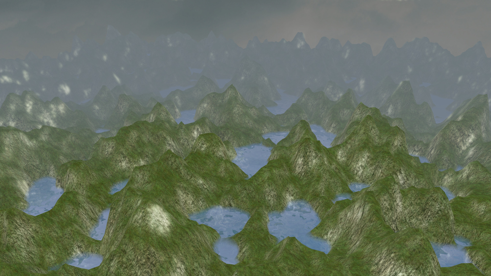
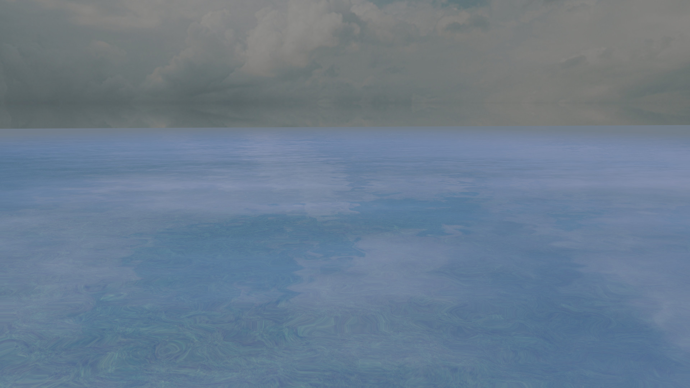

# Procedural-Terrain-Generator-OpenGL
### Procedural Terrain Generator With Tessellation OpenGL 4.1 | C++



YouTube video: https://www.youtube.com/watch?v=KDmZJgTf-HE

### How it work?
**Terrain:**
For creating realistic surface I choosed Perlin Noise or simply noise method to generate heightmap. Heightmap is stored in 2D texture. The same data which we generate is used for convert heightmap to normalmap. That process is achieved by using Sobel Operator and normalize texture data. By the way it is easy to generated normal in shaders but that is expensive for efficient of our gpu. CPU do that faster and once, so for me better. And again we have to pass normalmap to graphic card memory as 2D texure. So now we have two textures. We can pass textures to shaders and use as samplers. Heightmap is used to increase y-axis in tesselation evaluation shader and normalmap is used to calculate the normal of surface to make proper light. OpenGL 4.0 provide us tesselation feature. With Tessellation it is easy to create terrain with dynamic level of detail. Distance between surface and camera can be used for evaluation the LOD. So if we're farther from the surface it will be rendered faster. Answer is short: tessellation is also in use in this project.

**Water:**
Water is a simple plane without tessellation. The water is using dudv map for realistic movement the water and normalmap to calculate light. Water include reflections and refraction for good visual effect. The reflection on the water are created by bind the custom framebuffer and render the scene, but before we have to set the camer under the water. This method allow us to save actual scene to the texture instead straight to the screen something like post processing but we pass that to the water surface not to the screen space. The refraction are creating in the same way but the clip distance is different for each step but camera must be above the water level. For reflections we are rendering scene above the water and for the refraction all what is bellow the water. In the end all of textures are mixing in fragment shader and creating realistic calm water. This method force rendering the scene three times and once the water.

**This application is based on [my own Engine 3D](https://github.com/stanfortonski/3D-Engine-OpenGL-4).**

### Control/Input:
```
  mouse - rotation the camera
  WASD - movement
  P - polygon mode on
  O - object mode on so off polygon mode
  Y - increase level of tessellation
  T - decrease level of tessellation
  C - shadows on
  Z - shadows off
  N - water on
  M - water off
  ESC - exit
  1-0 - Ten methods for terrain generation
  = - increase height level
  - - decrease height level
```

**Package includes exe file compiled in Windows 10 MinGW G++ and dll files.**

### Requirements:
- Efficient graphics card that support OpenGL 4.1
- Graphics card drivers

Tested on RX 480 and GTX 650 ti.

### Screenshots:









